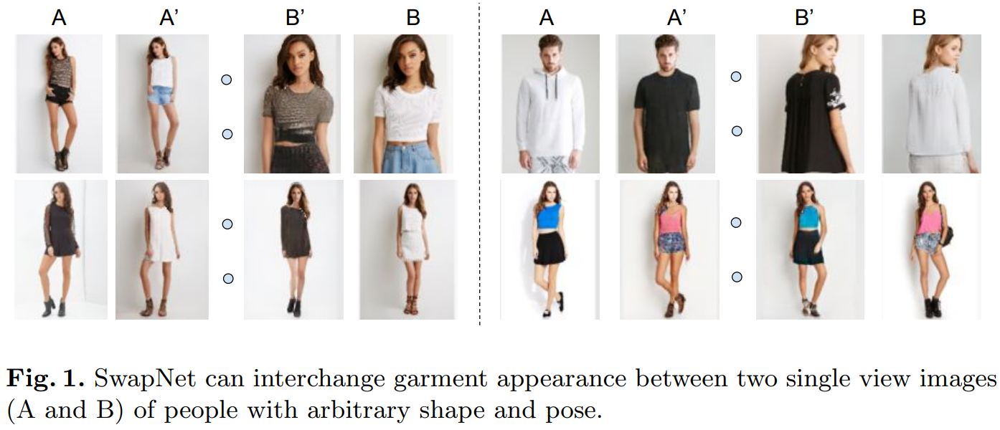
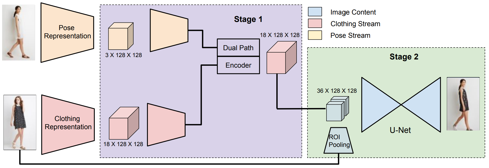
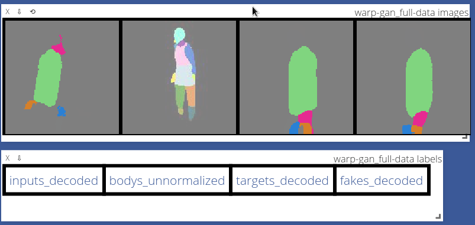
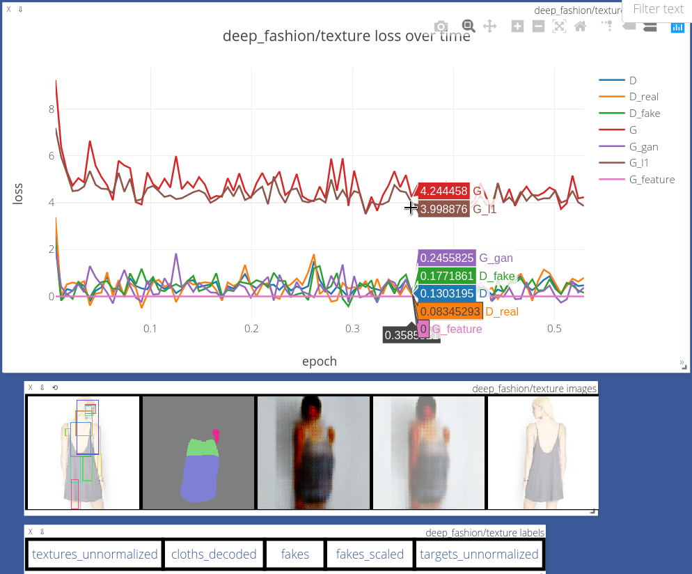
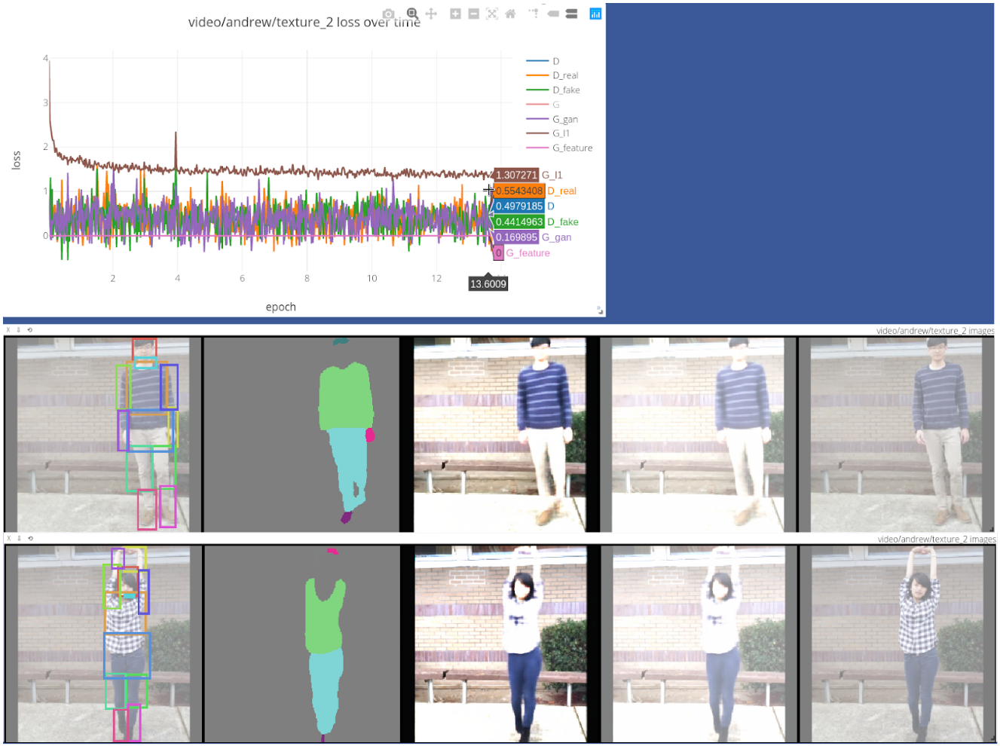

# STATUS AS OF SEPTEMBER 4 2020
Hi all, thank you for your interest in my replication of this baseline! Since this repository seems to be generating a lot of traffic under issues, I just wanted to comment that I'm currently **not** able to maintain this repository. I'm working on a separate virtual try-on publication+codebase which I hope to release by next month (October). I welcome and will merge good PRs, but I won't be able to resolve issues for the time being. Thanks for understanding!

# SwapNet
**Community PyTorch reproduction of SwapNet.**

<p align="center">


</p>

For more than a year, I've put all my efforts into reproducing [SwapNet (Raj et al. 2018)](http://www.eye.gatech.edu/swapnet/paper.pdf). Since an official codebase has not been released, by making my implementation public, I hope to contribute to transparency and openness in the Deep Learning community.

## Contributing
I'd welcome help to improve the DevOps of this project. Unfortunately I have other life priorities right now and don't have much time to resolve these particular issues. If you'd like to contribute, please look for the [help-wanted](https://github.com/andrewjong/SwapNet/issues?q=is%3Aopen+is%3Aissue+label%3A%22help+wanted%22) label in the Issues. Please feel free to email me for questions as well.

# Installation

<details>
<Summary> Option 1: Install with Docker </Summary>
    
Many thanks to Urwa Muaz for getting this started.

You can install and run this code using [Docker](https://docs.docker.com/install/) 
(specifically community edition, Docker 19.03 or higher) and the provided Docker image.
Docker enables sharing the same environment across different computers and operating 
systems. This could save you some setup headache; however, there is some developer
overhead because you have to interact through Docker. If you prefer to build without 
Docker, skip to Option 2: Conda Install. Otherwise, follow the instructions below.


1. Clone this repo to your computer.
    ```bash
    git clone https://github.com/andrewjong/SwapNet.git
    cd SwapNet
   ```
2. If you have a GPU, make sure you have the 
[NVIDIA Container Toolkit](https://github.com/NVIDIA/nvidia-docker#quickstart) 
installed to connect your GPU with Docker. Follow their install instructions.

3. Pull the image from Docker Hub. The image is 9.29GB, so at least this much
space must be available on your hard drive. Pulling will take a while. 
    ```bash
    docker pull andrewjong/swapnet
    ```
4. Start a container that launches the Visdom server.
    ```bash
    docker run -d --name swapnet_env -v ${PWD}:/app/SwapNet -p 8097:8097 \
       --shm-size 8G --gpus all andrewjong/swapnet \
       bash -c "source activate swapnet && python -m visdom.server"
    ```
    Command explanation (just for reference, don't run this):
    ```bash
    docker                  # docker program
    run                     # start a new container
    -d                      # detach (leaves the process running)
    --name swapnet_env      # name the launched container as "swapnet_env"
    -v ${PWD}:/app/SwapNet  # mount our code (assumed from the current working directory) into Docker
    -p 8097:8097            # link ports for Visdom
    --shm-size 8G           # expand Docker shared memory size for PyTorch dataloaders
    --gpus all              # let Docker use the GPUs 
    andrewjong/swapnet      # the Docker image to run
    bash -c \               # start the visdom server
       "source activate swapnet \
       && python -m visdom.server"  
    ```
5. Start an interactive shell in the Docker container we created (swapnet_env). All the 
commands for training and inference can be run in this container.
    ```bash
    docker exec -it swapnet_env bash
    ```
6. Obtain the training data from the Dataset section. Note the data should be extracted
to your host machine (outside Docker) under `${SWAPNET_REPO}/data`. This will automatically
 reflect within the Docker container because of the command we ran in Step 4.

To run the environment in the future, just repeat step 4 and 5.
</details>

<details>
<summary> Option 2: Conda Install </summary>


I have only tested this build with Linux! If anyone wants to contribute instructions for Windows/MacOS, be my guest :)

This repository is built with PyTorch. I recommend installing dependencies via [conda](https://docs.conda.io/en/latest/).

With conda installed run:
```
git clone https://github.com/andrewjong/SwapNet.git
cd SwapNet/
conda env create  # creates the conda environment from provided environment.yml
conda activate swapnet
```

</details>

# Dataset
Data in this repository must start with the following:
- `texture/` folder containing the original images. Images may be directly under this folder or in sub directories.

The following must then be added from preprocessing (see the Preprocessing section below):
- `body/` folder containing preprocessed body segmentations 
- `cloth/` folder containing preprocessed cloth segmentations
- `rois.csv` which contains the regions of interest for texture pooling
- `norm_stats.json` which contain mean and standard deviation statistics for normalization

## Deep Fashion
The dataset cited in the original paper is 
[DeepFashion: In-shop Clothes Retrieval](http://mmlab.ie.cuhk.edu.hk/projects/DeepFashion/InShopRetrieval.html). 
I've preprocessed the Deep Fashion image dataset already. The full preprocessed dataset 
can be downloaded from [Google Drive](https://drive.google.com/open?id=1oGE23DCy06zu1cLdzBc4siFPyg4CQrsj).
Extract the data to `${SWAPNET_REPO}/data/deep_fashion`.

Next, create a file `${SWAPNET_REPO}/data/deep_fashion/normalization_stats.json`, and paste the following contents:
```json
{"path": "body", "means": [0.06484050184440379, 0.06718090599394404, 0.07127327572275131], "stds": [0.2088075459038679, 0.20012519201951368, 0.23498672043315685]}
{"path": "texture", "means": [0.8319639705048438, 0.8105952930426163, 0.8038053056173073], "stds": [0.22878186598352074, 0.245635337367858, 0.2517315913036158]}
```

If don't plan to preprocess images yourself, jump ahead to the Training section.

Alternatively, if you plan to preprocess images yourself, download the original 
DeepFashion image data and move the files to `${SWAPNET_REPO}/data/deep_fashion/texture`.
Then follow the instructions below.

## Preprocess Your Own Dataset (Optional)
If you'd like to prepare your own images, move the data into `${SWAPNET_REPO}/data/YOUR_DATASET/texture`.

The images must be preprocessed into BODY and CLOTH segmentation representations. These will be input for training and inference.

#### Body Preprocessing
The original paper cited [Unite the People](https://github.com/classner/up) (UP) to obtain body segmentations; however, I ran into trouble installing Caffe to make UP work (probably due to its age). 
Therefore, I instead use [Neural Body Fitting](https://arxiv.org/abs/1808.05942) (NBF). [My fork of NBF](https://github.com/andrewjong/neural_body_fitting-for-SwapNet) modifies the code to output body segmentations and ROIs in the format that SwapNet requires. 

1) Follow the instructions in my fork. You must follow the instructions under "Setup" and "How to run for SwapNet". Note NBF uses TensorFlow; I suggest using a separate conda environment for NBF's dependencies.

2) Move the output under `${SWAPNET_REPO}/data/deep_fashion/body/`, and the generated rois.csv file to `data/deep_fashion/rois.csv`.

*Caveats:* neural body fitting appears to not do well on images that do not show the full body. In addition, the provided model seems it was only trained on one body type. I'm open to finding better alternatives.

#### Cloth Preprocessing
The original paper used [LIP\_SSL](https://github.com/Engineering-Course/LIP_SSL). I instead use the implementation from the follow-up paper, [LIP\_JPPNet](https://arxiv.org/pdf/1804.01984.pdf). Again, [my fork of LIP\_JPPNet](https://github.com/andrewjong/LIP_JPPNet-for-SwapNet) outputs cloth segmentations in the format required for SwapNet.

1) Follow the installation instructions in the repository. Then follow the instructions under the "For SwapNet" section.

2) Move the output under `${SWAPNET_REPO}/data/deep_fashion/cloth/`

#### Calculate Normalization Statistics
This calculates normalization statistics for the preprocessed body image segmentations, under `body/`, and original images, under `texture/`. The cloth segmentations do not need to be processed because they're read as 1-hot encoded labels.

Run the following: `python util/calculate_imagedir_stats.py data/deep_fashion/body/ data/deep_fashion/texture/`. The output should show up in `data/deep_fashion/norm_stats.json`.

# Training

Train progress can be viewed by opening `localhost:8097` in your web browser.
If you chose to install with Docker, run these commands in the Docker container.

1) Train warp stage
```
python train.py --name deep_fashion/warp --model warp --dataroot data/deep_fashion
```
Sample visualization of warp stage:
<p align="center">

</p>

2) Train texture stage
```
python train.py --name deep_fashion/texture --model texture --dataroot data/deep_fashion
```
Below is an example of train progress visualization in Visdom. The texture stage draws the input texture with ROI 
boundaries (left most), the input cloth segmentation (second from left), the generated 
output, and target texture (right most).

<p align="center">


</p>

# Inference
To download pretrained models, download the `checkpoints/` folder from [here](https://drive.google.com/open?id=1kaeHlGf9h3vZLBxr4D5yQUgToxEUWuMh) and extract it under the project root. Please note that these models are not yet perfect, requiring a fuller exploration of loss hyperparameters and GAN objectives.


Inference will run the warp stage and texture stage in series.

To run inference on deep fashion, run this command:
```
python inference.py --checkpoint checkpoints/deep_fashion \
  --dataroot data/deep_fashion \
  --shuffle_data True
```
`--shuffle_data True` ensures that bodys are matched with different clothing for the transfer. 
By default, only 50 images are run for inference. This can be increased by setting the value of `--max_dataset_size`.


Alternatively, to translate clothes from a specific source to a specific target:
```
python inference.py --checkpoint checkpoints/deep_fashion \
  --cloth_dir [SOURCE] --texture_dir [SOURCE] --body_dir [TARGET]
```
Where SOURCE contains the clothing you want to transfer, and TARGET contains the person to place clothing on.

# Comparisons to Original SwapNet
### Similarities
- Warp Stage
  - [x] Per-channel random affine augmentation for cloth inputs
  - [x] RGB images for body segmentations
  - [x] Dual U-Net warp architecture
  - [x] Warp loss (cross-entropy plus small adversarial loss)
- Texture Stage
  - [x] ROI pooling
  - [x] Texture module architecture
  - mostly everything else is the same

### Differences
- Warp Stage
  - Body segmentation: Neural Body Fitting instead of Unite the People (note NBF doesn't work well on cropped bodies)
  - I store cloth segmentations as a flat 2D map of numeric labels, then expand this into 1-hot encoded tensors at runtime. In the original SwapNet, they used probability maps, but this took up too much storage space (tens of dozens of GB) on my computer.
  - Option to train on video data. For video data, the different frames provide additional "augmentation" for input cloth in the warp stage. Use `--data_mode video` to enable this.
- Texture Stage
  - Cloth segmentation: LIP_JPPNet instead of LIP_SSL
  - Currently VGG feature loss prevents convergence, need to debug!
- Overall
  - Hyperparameters most likely; the hyperparameters were not listed in the original paper, so I had to experiment with these values.
  - Implemented random label smoothing for better GAN stability

### TODO:
- [ ] Copy face data from target to generated output during inference ("we copy the face and hair pixels from B into the result")
- [ ] Match texture quality produced in original paper (likely due to Feature Loss)
- [ ] Test DRAGAN penalty and other advanced GAN losses

# What's Next?
I plan to keep improving virtual try-on in my own research project (I've already made some progress which is scheduled to be published in the upcoming HPCS 2019 proceedings, but I aim to contribute more.) Stay tuned.

# Credits
- The layout of this repository is strongly influenced by Jun-Yan Zhu's [pytorch-CycleGAN-and-pix2pix](https://github.com/junyanz/pytorch-CycleGAN-and-pix2pix) repository, though I've implemented significant changes. Many thanks to their team for open sourcing their code.
- Many thanks to Amit Raj, the main author of SwapNet, for patiently responding to my questions throughout the year.
- Many thanks to Khiem Pham for his helpful experiments on the warp stage and contribution to this repository.
- Thank you Dr. Teng-Sheng Moh for advising this project.
- Thanks Urwa Muaz for [starting](https://github.com/andrewjong/SwapNet/pull/27) the Docker setup.
